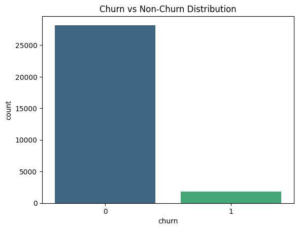
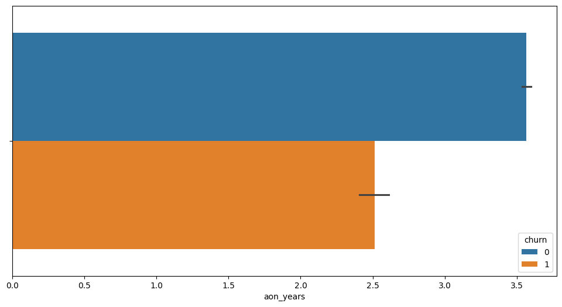
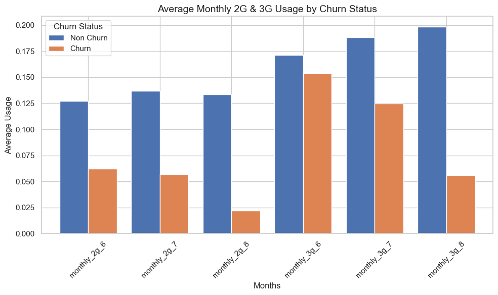
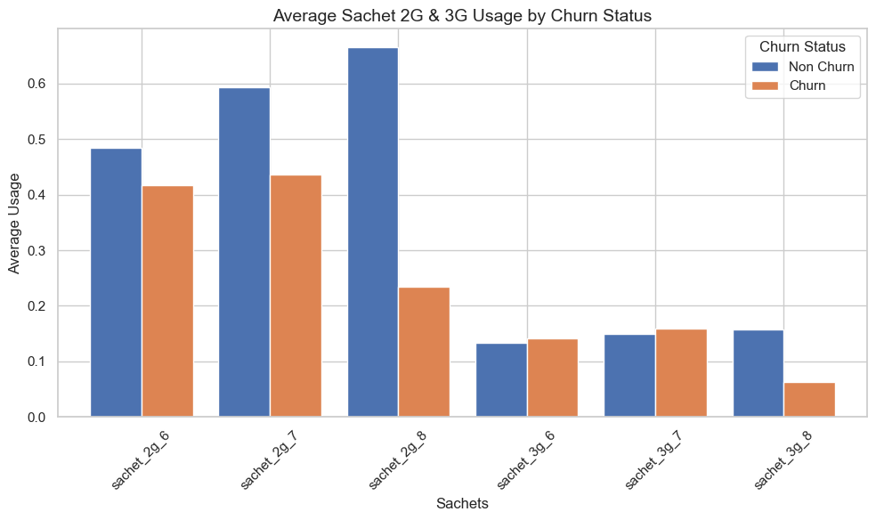
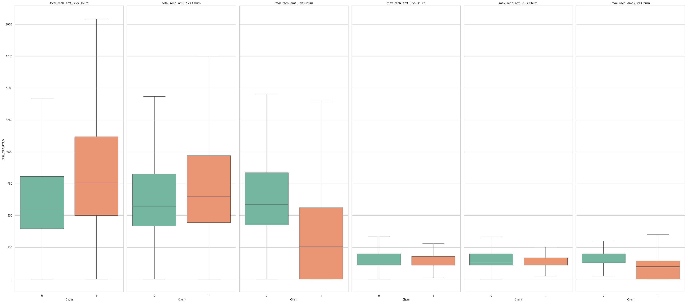
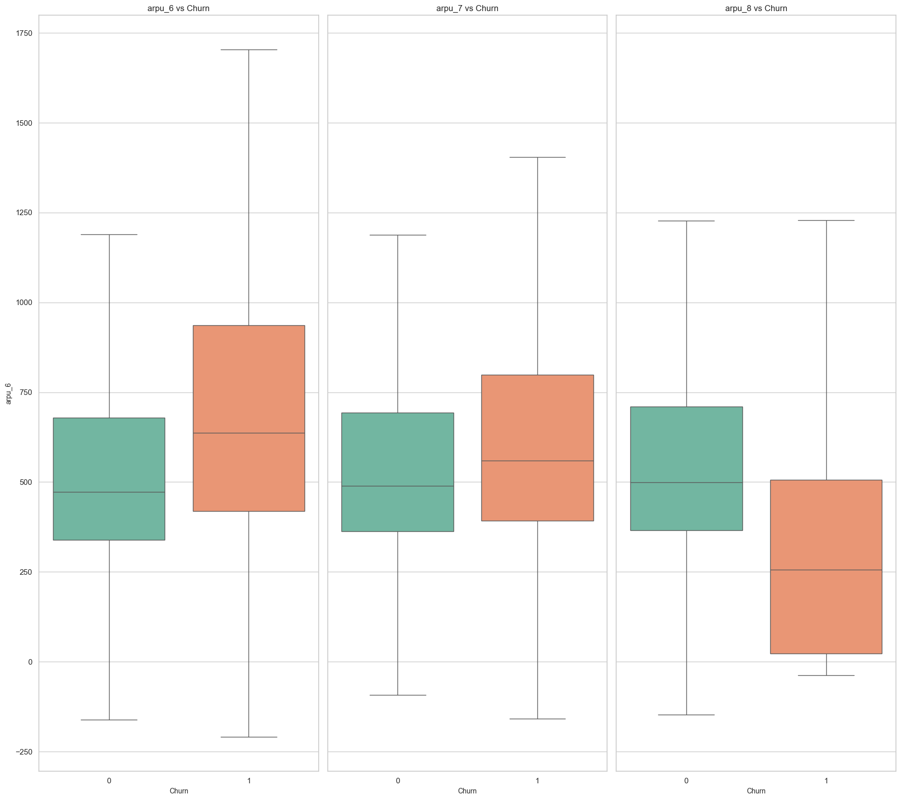
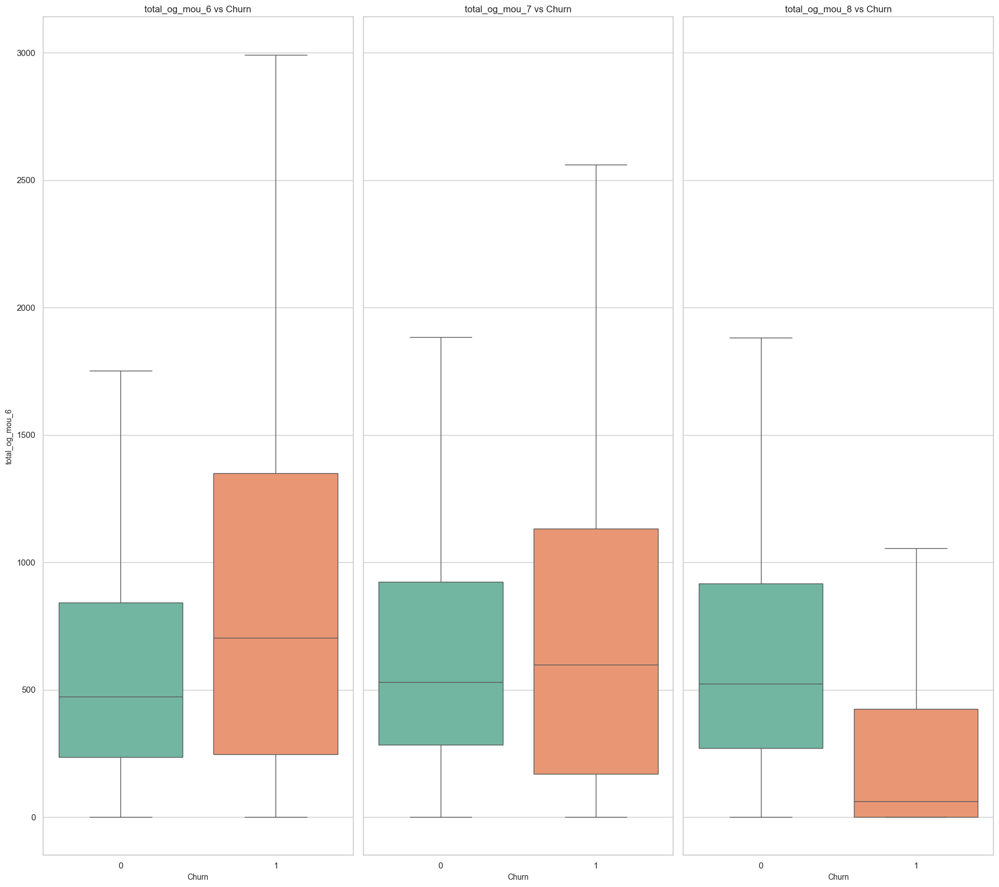
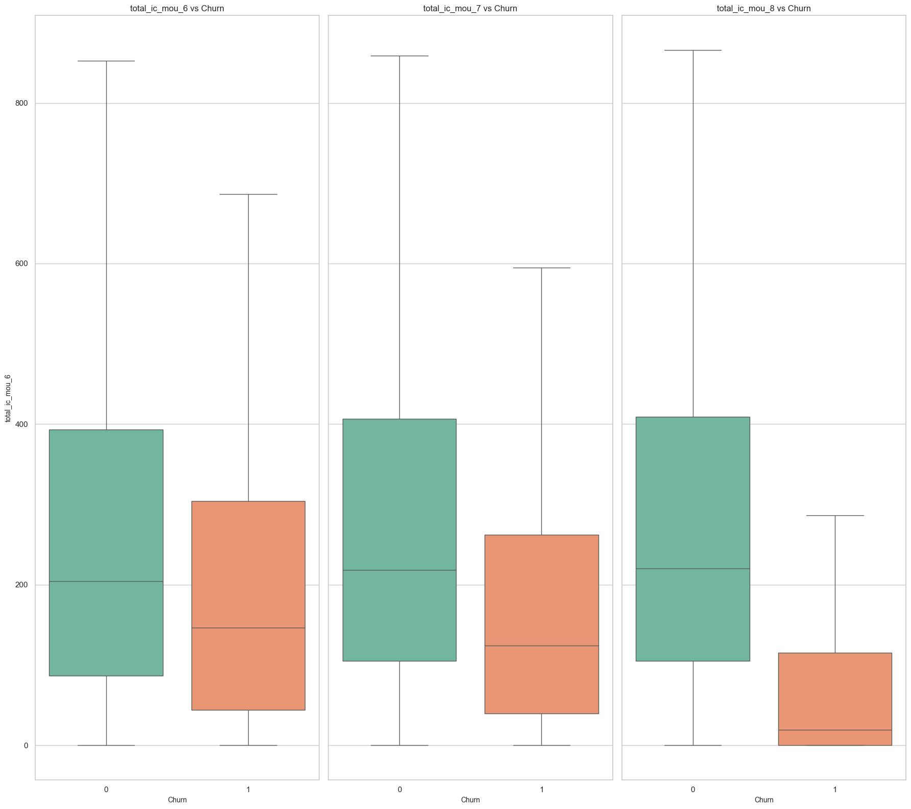
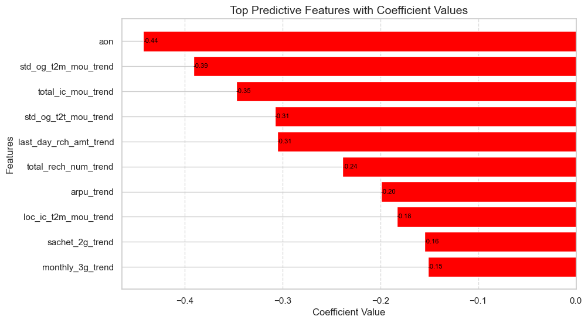
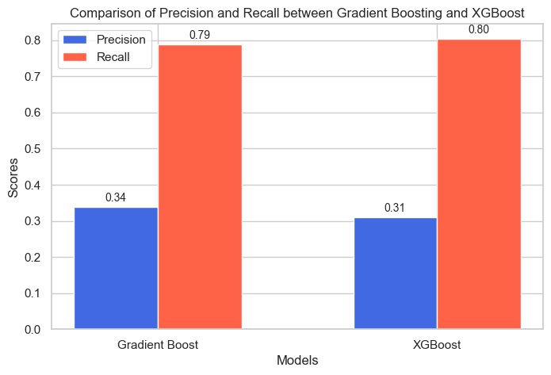

# Customer Churn Prediction Project

## Business Context:
A leading telecom provider wants to reduce customer churn by identifying high - value customers at risk of leaving. The company has historical data covering four months of customer usage behaviour, including call details, internet usage, and recharge history.

Customer churn is defined a suser who stops using the service in the last month. The goal is to develop a machine learning model that can predict whether a high-value customer will churn in the upcoming month baed on usage patterns.

## Business Objectives:
- Predict churn in advance to take preventive actions like offering discounts or personalized plans.
- Identify Key drivers of churn to improve customer relations strategies.
- Minimize revenue loss by targeting high-value customers who are likely to leave.

## **Project Overview**
This project focuses on predicting customer churn using machine learning models. The aim is to identify customers likely to leave the service, allowing proactive retention strategies. We performed extensive data preprocessing, feature engineering, model selection, and evaluation to achieve optimal results.

## **Dataset Description**

| **Acronyms**      | **Descriptions**  |
|------------------|------------------|
| **MOBILE_NUMBER** | Customer phone number  |
| **CIRCLE_ID** | Telecom circle area to which the customer belongs to  |
| **LOC** | Local calls - within same telecom circle  |
| **STD** | STD calls - outside the calling circle  |
| **IC** | Incoming calls  |
| **OG** | Outgoing calls  |
| **T2T** | Operator T to T, i.e., within same operator (mobile to mobile)  |
| **T2M** | Operator T to other operator mobile  |
| **T2O** | Operator T to other operator fixed line  |
| **T2F** | Operator T to fixed lines of T  |
| **T2C** | Operator T to its own call center  |
| **ARPU** | Average revenue per user  |
| **MOU** | Minutes of usage - voice calls  |
| **AON** | Age on network - number of days the customer is using the operator T network  |
| **ONNET** | All kinds of calls within the same operator network  |
| **OFFNET** | All kinds of calls outside the operator T network  |
| **ROAM** | Indicates that customer is in roaming zone during the call  |
| **SPL** | Special calls  |
| **ISD** | ISD calls  |
| **RECH** | Recharge  |
| **NUM** | Number  |
| **AMT** | Amount in local currency  |
| **MAX** | Maximum  |
| **DATA** | Mobile internet  |
| **3G** | 3G network  |
| **AV** | Average  |
| **VOL** | Mobile internet usage volume (in MB)  |
| **2G** | 2G network  |
| **PCK** | Prepaid service schemes called - PACKS  |
| **NIGHT** | Scheme to use during specific night hours only  |
| **MONTHLY** | Service schemes with validity equivalent to a month  |
| **SACHET** | Service schemes with validity smaller than a month  |
| **\*.6** | KPI for the month of June  |
| **\*.7** | KPI for the month of July  |
| **\*.8** | KPI for the month of August  |
| **\*.9** | KPI for the month of September  |
| **FB_USER** | Service scheme to avail services of Facebook and similar social networking sites  |
| **VBC** | Volume-based cost - when no specific scheme is purchased and paid as per usage |

## Data Insights:
## **1. General Overview**
- The dataset contains **30,024** observations.
- It includes customer call, recharge, and internet usage data across **four months (June, July, August, September)**.
- The dataset is used to predict churn in the **ninth month (September)** based on usage behavior from the **first three months (June, July, August).**
- Most of the features are **numeric**, with a few **date-based columns**.

---

## **2. Key Insights from Descriptive Statistics**

### **(A) General Customer Usage**
- **`arpu_6`, `arpu_7`, `arpu_8` (Average Revenue Per User per month)**
  - Mean values range between **₹568 to ₹589**.
  - There are **negative values**, which may indicate refunds, adjustments, or incorrect data.
  - High standard deviation (~₹450), suggesting **high variance in spending patterns**.

- **`onnet_mou`, `offnet_mou` (Minutes of Use - On-net and Off-net calls)**
  - Mean on-net minutes ~ **284 to 305 min/month**.
  - Mean off-net minutes ~ **405 to 426 min/month**.
  - Some users have **zero usage**, while a few have **extremely high call minutes (up to ~10,752 mins in a month).**

- **Roaming Calls (`roam_ic_mou`, `roam_og_mou`)**
  - Mean values are **very low (~16-28 mins)** per month.
  - Most customers do **not use roaming frequently**, but a few have **very high roaming usage (~4,100 mins).**

---

### **(B) Data and Internet Usage**
- **2G and 3G Usage (`vol_2g_mb`, `vol_3g_mb`)**
  - **Very skewed** distribution; most customers have **zero or very low** data usage.
  - Some customers have **extremely high** usage (e.g., **45GB in a month**).
  - Standard deviation is high, indicating **high variance in data consumption.**

- **Recharges (`total_rech_amt`, `total_rech_data`)**
  - Mean recharge amount is around **₹671-₹692 per month**.
  - Some customers have **zero recharge activity** (potential churners).
  - **Maximum recharge amounts exceed ₹40,000**, indicating **outliers or corporate accounts.**
  - Recharge count is also skewed, with **some customers making 138+ recharges per month.**

---

### **(C) Subscription Packs and Special Schemes**
- **Prepaid Plans (`monthly_2g`, `monthly_3g`, `sachet_2g`, `sachet_3g`)**
  - Many users **do not subscribe to monthly data packs**, relying more on **sachet (short-term) data plans.**
  - **Sachet 3G plans are more popular than Monthly 3G plans.**
  - There is **significant variation** in customer subscription patterns.

---

### **(D) Churn Behavior**
#### count plot
The following count plot shows the distribution of number of churners and non churners:


- **Churn Rate (`churn` column)**
  - Only **6.1% of customers have churned** (binary 0/1).
  - This is a **highly imbalanced dataset**, which requires **handling techniques like SMOTE, cost-sensitive learning, or stratified sampling**.

---

### **(E) Age On Network**
#### Bar Plot
The following bar plot shows the distribution of churn proba based on `age on network`.


- **Age On Network**
    - Age on network less than 2 years are in the potential category for churning.
    - Age on network more tgan 3 or 4 years are the loyal customers who arenot likely to churn.

### **(F) 2G/3G average Monthly usage**
The following charts are the usage of 2g and 3g services by churners and nonchurners


- **Average 2g/3g monthly usage**
    - **Non Churn Behavior:** considerably more Data Usage  and steady usage over 3 months, people prefer 3G more than 2G.
    - **Churn Behavior:** Considerably less data usage compared to non churners which shows us that less usage of internet is a strong predictor for churn, also it is to be noted that in month 8 the internet usage decreases quite a much, now we can easily conclude the customers are indicating of not continuing with the service.

### **(G) 2G/3G average Sachet usage**
the following chart show sthe usage of 2g and 3g services based on sachets.


- **Average 2g/3g Sachet Usage**
    - **Non churn behavior:** Consistently higher usage of 2G sachets (sachet_2g_6, sachet_2g_7, sachet_2g_8), especially peaking in month 8. Although 3G sachet usage is lower overall, it remains relatively steady across all months.
    - **Churn Behavior:** Noticeable decline in sachet_2g_8, indicating reduced engagement as they approach churn. sachet_3g_6 and sachet_3g_7 usage is slightly higher than non-churned customers, possibly indicating trial behavior before deciding to churn.
Significant drop in month 8, reinforcing that they’ve likely disengaged from the network completely by then.

### **(H) Recharge Amount**
the following chart shows the total recharge done by the customers over the three months.


- **Recharge Amount**
    - **`Total Recharge Amount (June,July, August)`**
    - `june & July`: Customers who churned (churn = 1) had a higher median recharge amounts compared to non-churned users. This suggest that even though these customers were spending more initially, they might left
    - `August`: A drstic drop in recharge, Many churned users have near-zero recharge, indicating the beginning of churn behavior.
    - **`Maximum Recharge Amount(June, July, August)`**
    - `June & July:` Churned customers show lower maximum recharge amounts compared to non-churned users across all three months.
    - `August :` Churned customers have the lowest maximum recharge values, reinforcing the fact that disengagement starts before the actual churn.

### **(I) Average Revenue Per User**
the following chart shows the averagerevenue per user oer the three months.

- **Average Revenue Per User**
    - **Non Churner Behavior:** average revenue per user for non churners tend to remain steady depicting loyal customers 
    - **Churn Behavior:** average revenue per user for churners tend to decrease over time. we can also see the churners tend to give  a lot of revenue before but for some reason in the third phase or in the action phase their revenue decreases a lot compared to non churners predicting churned behavior.

### **(J) Total Outgoing Call Minutes of Usage**
The foloowing chart shows the minutes of Usage of all the out going calls.

- **Total Outgoing minutes of Usage**
    - **Non Churn Behavior:** Observation of the charts tells us clearly that withn the three months the non churners have a consistent usage.
    - **Churn Behavior:** The churners shows us a clear pattern of disengagement, like they have high number of call usage in the first 2 months but in the third month a significant drop is seen indicating churn behavior

### **(K) Total Incoming Call Minutes of Usage**
The foloowing chart shows the minutes of Usage of all the out going calls.

- **Total Incoming call minutes of Usage**
    - **Non Churners Behavior:** Observation of the charts tells us that non churners tend to havea consistent usage.
    - **Churners Behavior:** Churners have a clear pattern of Disengagement. Same as outgoing call churners are quite active in the first two months but in the third month churners shows a reduction in usage indication churn behavior.

## **Model For Feature Importance**
`Logistic Regression` for feature importance.


## **Key Features**
  1. `aon`(-0.44): Customers with a longer "Age on Network" are less likely to churn. High loyalty is often associated with longer tenure.
  2. `std_og_t2m_mou trend`(-0.39): A decline in standard outgoing calls to mobile numbers is associated with a higher churn probability.
  3. `last_day_rch_amt_trend`(-0.31): A decline in the last recharge amount suggests that customers are not recharging as frequently, which is a strong churn signal.
  4. `std_og_t2t_mou _trend`(-0.31):A decreasing trend in standard outgoing calls to the same network (T2T) indicates customers reducing engagement, leading to churn.
  5. `total_ic_mou_trend`(-0.35):A drop in total incoming call minutes suggests disengagement and could be a precursor to churn.
  6. `total_rech_num_trend`(-0.24): Fewer recharge transactions over time indicate reduced commitment to the service.
  7. `arpu_trend`(-0.20):A drop in Average Revenue Per User (ARPU) over time signifies a decrease in customer spending, likely due to switching plans or reducing usage.            
  8. `loc_ic_t2m_mou_trend` (-0.18): Local incoming call trends to mobile numbers have a weaker but notable relationship with churn.
  9. `sachet_2g_trend` (-0.16): A decline in sachet (short-term) 2G data pack usage suggests customers are either shifting to other providers or upgrading.
  10. `monthly_3g_trend` (-0.15): A decreasing trend in monthly 3G data consumption may indicate customers are moving to competitors with better data plans.

## **Modeling Approach**
- **Machine Learning Models:** Decision Tree, Random Forest, Gradient Boosting, XGBoost
- **Imbalanced Data Handling:** SMOTE and Random Undersampling
- **Evaluation Metrics:** Accuracy, Precision, Recall, F1-Score, ROC-AUC

## **Model Comparison**


## **Best Performing Model**
- **Model:** XG Boosting Classifier
- **Training Accuracy:** 90%
- **Testing Accuracy:** 87%
- **Recall (Churn Class):** 80% 

## **Strategies to Reduce Churn**
1. **Loyalty Programs:** Target long-term customers to strengthen retention.
2. **Personalized Offers:** Based on declining recharge trends and ARPU.
3. **Proactive Engagement:** With customers showing reduced call activity.
4. **Roaming Plans:** For customers with increasing roaming usage to prevent dissatisfaction.

## **Installation and Setup**
1. Clone this repository:
```bash
git clone https://github.com/your-repo/customer-churn-prediction.git 
```
2. Install dependencies:
```bash
pip install -r requirements.txt
```